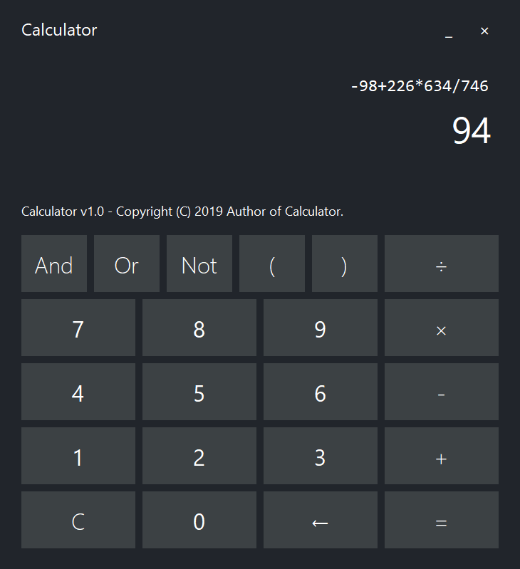

# Qt-Calculator

</img>

This is a simple calculator based on Qt.

> The first release of Calculator (`v1.0`) has released. [Try it out!](https://github.com/YangHanlin/Qt-Calculator/releases/tag/v1.0)

## Building

### Dependencies

- Visual Studio (Recommended: Visual Studio 2019+), with module `Desktop Development with C++` installed
- Qt (Recommended: Qt 5.12.3+)

> You may have to install an extension
> ([Qt VS Tools](https://marketplace.visualstudio.com/items?itemName=TheQtCompany.QtVisualStudioTools2019))
> to make Visual Studio capable for developing Qt projects. Please follow the
> instructions given by the extension for advice on configuration.

### Steps

1. Download/clone all files in this repository to your computer;
2. Open the solution file `QtCalculator.sln` with Visual Studio;
3. Select `Debug > Start Debugging` or press `F5` to build & run.
